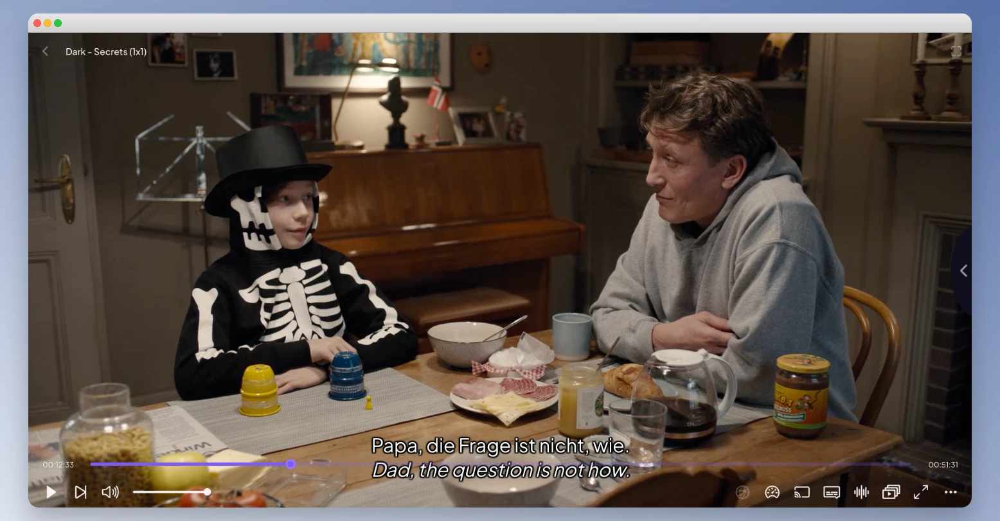

# Stremio Double Subtitles

Fetches subtitles from the public Stremio OpenSubtitles v3 addon, translates them with `googletrans` or DeepL, merges them together and serves generated WebVTT subtitles to Stremio. No OpenSubtitles or Google Translate credentials are required.



## Setup

Install dependencies:

```bash
pnpm install
```

## Run

```bash
pnpm start
```

Open the local web interface and choose the source and target languages:

```text
http://127.0.0.1:53100/
```

Install it on Stremio using instructions from the web interface.

The generated subtitle is one double subtitle: source language on top, translated language on the bottom.

### Docker

```bash
docker run -p 53100:53100 ghcr.io/awerks/stremio-double-subtitles:latest
```

then open the local web interface
